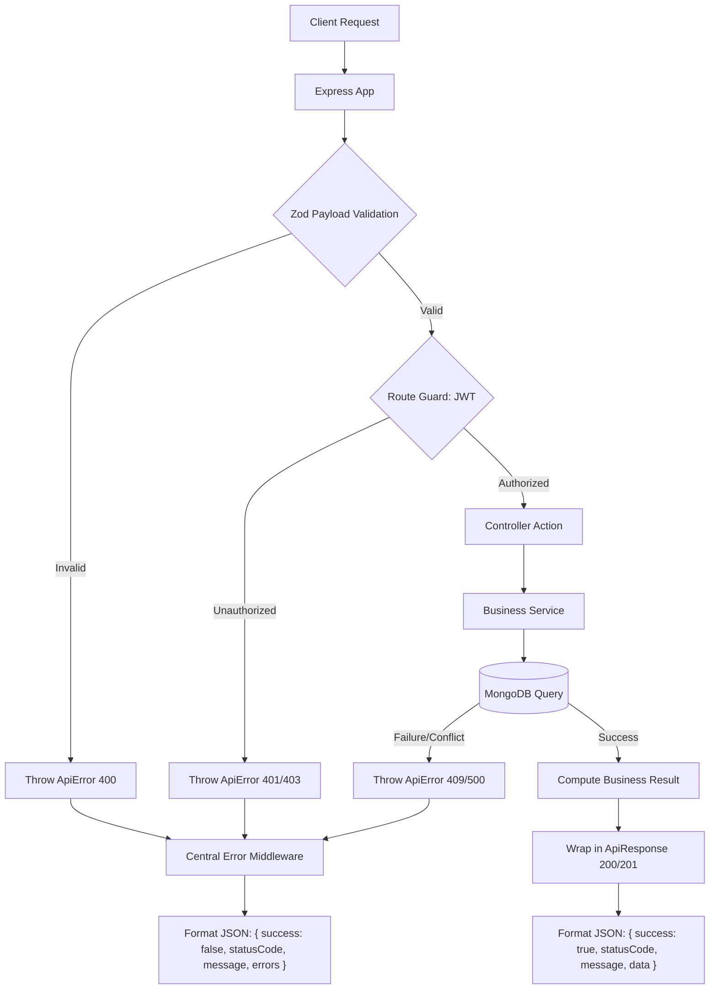
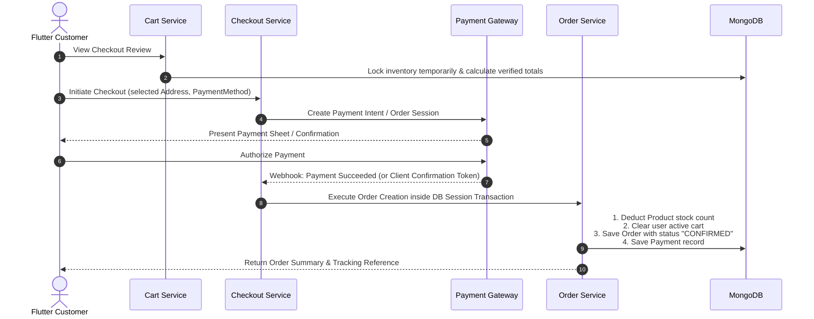
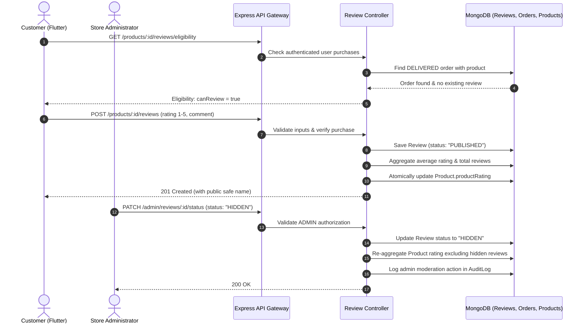

# SHOPPY — SYSTEM ARCHITECTURE SPECIFICATION

---

## 1. Architectural Overview & Philosophy

The architecture of Shoppy is designed to separate concerns cleanly, ensure end-to-end type safety, enforce server-side business integrity, and support scalable horizontal growth.

---

## 2. Current Architecture (As-Is Audit)

### 2.1 Current Flutter Architecture
The existing Flutter code is an early prototype with tightly coupled layers and partial state management:

```text
[Views (Stateless/Stateful Widgets)]
         ↓ direct setState / Provider read/watch
[UserProvider (ChangeNotifier)]
         ↓ direct calls
[AuthRepository]
         ↓ instantiation
[Api (Dio Client with Hardcoded Basic Auth)]
         ↓ HTTP
[External Backend (Unconnected / 404)]
```

* **Data Storage**: `lib/core/preferences.dart` wraps `SharedPreferences` with static methods.
* **Navigation**: Ad-hoc `Navigator.push` with anonymous `MaterialPageRoute` instantiated inside button handlers.
* **Error Propagation**: Print statements, logs, or unhandled exceptions that propagate to UI threads.

### 2.2 Current Backend Architecture
The backend is an incomplete Express application lacking the fundamental layers of a REST service:

```text
[Client Request]
       ↓
[src/index.js (Port 8000)]
       ↓
[src/app.js (Express with CORS, JSON body parser)]
       ↓
[NO ROUTES REGISTERED (Returns 404)]
       ❌ (Broken controllers/services missing)
[src/models/*.model.js (Defective Mongoose Schema exports)]
       ❌ (Cannot instantiate or query)
[MongoDB ("Shoppy")]
```

* **No routing table**: `src/app.js` lacks route registrations.
* **No middleware pipeline**: Auth verification and error handling middleware are absent.
* **Defective models**: All models export `mongoose.Schema(...)` instead of `mongoose.model(...)`.

---

## 3. Target Production Architecture (To-Be Specification)

To achieve enterprise-grade resilience, Shoppy transitions to a clean, multi-tier decoupled architecture across both client and server.

### 3.1 Target Flutter Architecture (Layered Clean Architecture / MVVM)

```text
┌────────────────────────────────────────────────────────┐
│                   PRESENTATION LAYER                   │
│   [Screens / Views]  ◄──►  [Atomic Reusable Widgets]   │
│             │                       ▲                  │
│             ▼                       │ State Stream     │
│   [State Notifiers / Riverpod / Providers / Blocs]    │
└───────────────────────────┬────────────────────────────┘
                            │ Method Invocations
┌───────────────────────────▼────────────────────────────┐
│                      DOMAIN LAYER                      │
│   [Business Entities / Models]                         │
│   [Use Cases / Interactors] (Optional for complex biz) │
│   [Repository Interfaces (Contracts)]                  │
└───────────────────────────┬────────────────────────────┘
                            │ Interface Implementation
┌───────────────────────────▼────────────────────────────┐
│                       DATA LAYER                       │
│   [Repository Implementations]                         │
│             │                                          │
│      ┌──────┴──────────────────────────┐               │
│      ▼                                 ▼               │
│ [Remote Data Source]          [Local Data Source]      │
│ (Dio + Secure Interceptors)   (SecureStorage + Hive)   │
└────────────────────────────────────────────────────────┘
```

### 3.2 Target Backend Architecture (Layered Modular Express)

```text
[Incoming HTTP Request]
         │
         ▼
[Express Global Middlewares: Helmet, CORS, RateLimiter, BodyParser, RequestLogger]
         │
         ▼
[Central Route Registry (/api/v1/...)]
         │
         ▼
[Route Guards & Middleware: AuthGuard (JWT), RoleGuard (RBAC), Validation (Zod)]
         │
         ▼
[Controllers: Parse inputs, orchestrate DTOs, invoke services, format ApiResponse]
         │
         ▼
[Services: Pure business logic, transaction boundaries, pricing & inventory calculations]
         │
         ▼
[Data Access / Repositories / Mongoose Models: MongoDB operations, aggregations, atomic updates]
         │
         ▼
[Database: MongoDB Replica Set]
```

---

## 4. Directory Structure (Current vs Target)

### 4.1 Flutter Directory Structure

#### Current:
```text
shoppy/lib/
├── constants/
│   └── urls.dart
├── core/
│   ├── api.dart
│   └── preferences.dart
├── data/
│   ├── models/
│   │   ├── api_response.dart
│   │   ├── cart_model.dart
│   │   ├── currrent_user_model.dart
│   │   ├── product_model.dart
│   │   └── user_model.dart
│   └── repositories/
│       └── auth_repository.dart
├── main.dart
├── providers/
│   └── user_provider.dart
└── views/
    ├── cart_page.dart
    ├── home_page.dart
    ├── login_page.dart
    └── sign_up_page.dart
```

#### Target:
```text
shoppy/lib/
├── core/
│   ├── config/ (environment flavors: dev, staging, prod)
│   ├── constants/ (app_colors, app_typography, api_endpoints, asset_paths)
│   ├── network/ (dio_client, auth_interceptor, error_interceptor, network_info)
│   ├── storage/ (secure_storage_service, shared_prefs_service)
│   ├── theme/ (app_theme, dark_theme, color_schemes)
│   ├── routing/ (app_router, route_names, auth_guard)
│   └── utils/ (formatters, validators, logger)
├── features/
│   ├── auth/
│   │   ├── data/ (datasources, models, repositories)
│   │   ├── domain/ (entities, repository_contracts)
│   │   └── presentation/ (controllers/providers, screens, widgets)
│   ├── catalog/
│   │   ├── data/
│   │   ├── domain/
│   │   └── presentation/
│   ├── cart/
│   │   ├── data/
│   │   ├── domain/
│   │   └── presentation/
│   ├── checkout/
│   │   ├── data/
│   │   ├── domain/
│   │   └── presentation/
│   ├── orders/
│   │   ├── data/
│   │   ├── domain/
│   │   └── presentation/
│   ├── profile/
│   │   ├── data/
│   │   ├── domain/
│   │   └── presentation/
│   └── admin/
│       ├── data/
│       ├── domain/
│       └── presentation/
├── shared/
│   ├── widgets/ (buttons, inputs, cards, dialogs, loaders, error_views)
│   └── models/ (api_response, pagination_meta)
└── main.dart
```

---

### 4.2 Backend Directory Structure

#### Current:
```text
shoppy-backend/src/
├── app.js
├── constants.js
├── db/
│   └── dbconnect.js
├── index.js
├── models/
│   ├── category.model.js
│   ├── order.model.js
│   ├── product.model.js
│   └── user.model.js
└── utils/
    ├── apiError.js
    ├── apiResponse.js
    └── asyncHandler.js
```

#### Target:
```text
shoppy-backend/src/
├── app.js (App initialization, middleware pipeline, route registration)
├── constants.js (System-wide constants and enums)
├── index.js (Process lifecycle, DB connection bootstrap, HTTP server listener)
├── config/ (env validation, db connection config, logger config)
├── db/
│   ├── dbconnect.js
│   └── seeds/ (initial categories, demo products, admin user)
├── middlewares/
│   ├── auth.middleware.js (JWT access verification)
│   ├── role.middleware.js (RBAC checks)
│   ├── validate.middleware.js (Schema validator using Zod)
│   ├── error.middleware.js (Centralized exception converter and response formatter)
│   └── rateLimiter.middleware.js
├── models/
│   ├── user.model.js
│   ├── product.model.js
│   ├── category.model.js
│   ├── order.model.js
│   ├── cart.model.js
│   ├── address.model.js
│   └── review.model.js
├── routes/
│   ├── index.js (Root aggregator: /api/v1/...)
│   ├── auth.routes.js
│   ├── product.routes.js
│   ├── category.routes.js
│   ├── cart.routes.js
│   ├── order.routes.js
│   ├── user.routes.js
│   └── admin.routes.js
├── controllers/
│   ├── auth.controller.js
│   ├── product.controller.js
│   ├── category.controller.js
│   ├── cart.controller.js
│   ├── order.controller.js
│   ├── user.controller.js
│   └── admin.controller.js
├── services/
│   ├── auth.service.js
│   ├── product.service.js
│   ├── cart.service.js
│   ├── order.service.js
│   └── payment.service.js
└── utils/
    ├── apiError.js
    ├── apiResponse.js
    ├── asyncHandler.js
    └── logger.js
```

---

## 5. End-to-End System Flows

### 5.1 Authentication Flow (JWT with Refresh Rotation)

```mermaid
sequenceDiagram
    autonumber
    actor User as Mobile App (Flutter)
    participant Dio as Dio Interceptor
    participant Gateway as Express Gateway
    participant AuthCtrl as Auth Controller
    participant UserDB as MongoDB (Users)

    User->>Dio: Submit Login (email, password)
    Dio->>Gateway: POST /api/v1/auth/login
    Gateway->>AuthCtrl: Validate payload & authenticate
    AuthCtrl->>UserDB: Find user & verify bcrypt hash
    UserDB-->>AuthCtrl: User record verified
    AuthCtrl->>AuthCtrl: Sign AccessToken (15m) & RefreshToken (7d)
    AuthCtrl->>UserDB: Persist hashed RefreshToken
    AuthCtrl-->>Dio: 200 OK with tokens + user profile
    Dio->>User: Save RefreshToken in SecureStorage; AccessToken in memory
    Note over User,Dio: Subsequent Authenticated Requests
    User->>Dio: Call Protected Endpoint
    Dio->>Gateway: GET /api/v1/user/profile (Authorization: Bearer <AccessToken>)
    alt Access Token Expired (401)
        Gateway-->>Dio: 401 Unauthorized (TokenExpired)
        Dio->>Gateway: POST /api/v1/auth/refresh-token (RefreshToken)
        Gateway->>AuthCtrl: Verify & rotate RefreshToken
        AuthCtrl-->>Dio: New AccessToken + rotated RefreshToken
        Dio->>Gateway: Retry original request with new token
        Gateway-->>User: 200 OK with requested data
    else Access Token Valid
        Gateway-->>User: 200 OK with profile data
    end
```

### 5.2 API Data & Error Flow



### 5.3 Checkout, Payment, and Order Creation Flow



### 5.3 Reviews & Ratings Lifecycle Flow



---

## 6. Migration Strategy (From Current Prototype to Target Architecture)

1. **Step 1 (Repair & Normalize Backend Core)**:
   * Fix `src/utils/asyncHandler.js`, `apiError.js`, and `apiResponse.js`.
   * Fix `mongoose.Schema(...)` vs `mongoose.model(...)` in all model files.
   * Fix typos in schemas (`prodcutName` -> `productName`, `orderprice` -> `orderPrice`).
   * Implement centralized error middleware in `src/middlewares/error.middleware.js`.
2. **Step 2 (Expose Standardized API Gateway)**:
   * Create `src/routes/index.js` and mount under prefix `/api/v1`.
   * Standardize envelope: `{ success: boolean, statusCode: number, message: string, data: any }`.
3. **Step 3 (Implement Auth & User Management)**:
   * Implement `auth.routes.js`, `auth.controller.js`, `auth.service.js`, and `auth.middleware.js`.
   * Fix `bcryptjs.hash` missing `await` bug in `user.model.js`.
4. **Step 4 (Synchronize Flutter Network & State Layer)**:
   * Clean up hardcoded credentials in `lib/core/api.dart`.
   * Fix interceptor path check logic bug (`||` to `&&`).
   * Switch client to `Authorization: Bearer <token>`.
   * Reconcile Flutter `ApiResponse` model with backend envelope.
5. **Step 5 (Feature Iterations)**:
   * Incrementally build out Catalog, Search, Cart, Checkout, and Orders according to Phase files.

---

## 7. Model Context Protocol (MCP) Subsystem Architecture

The Model Context Protocol subsystem (`src/ai/mcp/`) enables external and desktop AI agents (e.g. Claude Desktop, Cursor, and automated workflows) to interact directly with Shoppy via the standardized JSON-RPC 2.0 protocol (specification: `2024-11-05`).

### 7.1 Architecture & Separation of Concerns

* **Interface Adapter Layer**: MCP does not contain commerce logic or direct database mutations. It dispatches tool calls to the Phase 15 `ToolRegistry`, which routes to existing business services.
* **Dual Transports**:
  1. **HTTP & Server-Sent Events (SSE)**: `POST /api/v1/mcp` and `GET /api/v1/mcp/sse` for remote orchestrators and web agents.
  2. **Standard I/O (`stdio`)**: `bin/mcp-server.js` reading line-delimited JSON-RPC from `process.stdin` and writing to `process.stdout` for local desktop tools.
* **Anti-IDOR Security**: The caller's identity is derived server-side strictly from verified JWT tokens (`req.user._id`) or API key configuration; client-supplied user IDs are strictly rejected.
* **Two-Phase Confirmation**: Consequential actions (`cancel_order`) generate a pending proposal token with a 5-minute single-use TTL; the action is never performed autonomously without prior human confirmation.
* **Resource & Prompt Registries**: Exposes authoritative static/dynamic URIs (`shoppy://policies/*`, `shoppy://products/{id}`) and structured prompt templates (`shopping_assistant`, `product_comparison`, `order_help`).

---

## 8. AI Production Hardening, Kill Switch & Fail-Safe Architecture (Phase 18)

The Shoppy AI ecosystem incorporates enterprise-grade production hardening guarantees to ensure core commerce remains robust and immune to AI failures:

### 8.1 Non-Authoritative AI Mandate
* AI is strictly non-authoritative for business state: Prices, stock levels, discounts, shipping fees, payment captures, order statuses, and user permissions are computed by deterministic backend services and ACID database transactions.

### 8.2 Global AI Kill Switch & Modular Subsystem Flags
* **Global Switch (`AI_ENABLED=false`)**: Instantly disables all AI endpoints (returns HTTP 503 `AI_DISABLED`). Catalog search automatically runs pure keyword search from the database; recommendations gracefully fall back to store-wide trending items (HTTP 200).
* **Modular Flags**:
  - `AI_ASSISTANT_ENABLED`: Controls chat and conversation endpoints.
  - `AI_SEARCH_ENABLED`: Controls semantic vector search vs pure keyword search.
  - `AI_RAG_ENABLED`: Controls knowledge retrieval endpoints and prompt augmentation.
  - `AI_RECOMMENDATIONS_ENABLED`: Controls personalized ranking vs static catalog trending.
  - `MCP_ENABLED`: Controls JSON-RPC 2.0 MCP transports.
  - `AI_TOOLS_ENABLED`: Controls tool definitions exposed to the conversational model.

### 8.3 Failure Isolation & Circuit Breaking
* **LLM Provider Timeout**: Enforced with bounded 10,000ms max timeout (`Promise.race`).
* **Vector Search Timeout**: Enforced with 2,000ms timeout with automatic keyword fallback.
* **Agent Loop Safety**: Capped at `MAX_AGENT_STEPS = 5` with cycle detection stopping infinite loops.
* **IDOR & Confirmation Defense**: Actions derive caller context strictly from verified JWT tokens; consequential operations mandate single-use TTL confirmation tokens.

---

## 9. Real Backend + Riverpod + Hooks + Freezed Architecture & Figma UI (Final Release)

The final transformation of Shoppy brings production-grade architectural rigor and commercial Figma-quality visual execution:

### 9.1 Authoritative Backend + Local MongoDB Architecture
* **Live Database**: Backend communicates with MongoDB 7.0 (`localhost:27017` in Docker container `shoppy-mongodb`).
* **Zero Fake Data**: All mock and in-memory test fixtures are removed from production workflows.
* **Deterministic Server Authority**: All prices, product inventory, shipping calculations, promotional discounts, tax calculations, and order total sums are computed exclusively on the backend.
* **Flutter Client**: Communicates with the live backend at `http://localhost:8000` via authenticated Dio API client with Bearer tokens and automatic token refreshing. Flutter NEVER connects directly to the database.

### 9.2 Modern Reactive Flutter Architecture (Riverpod + Hooks + Freezed)
* **Root ProviderScope**: `ProviderScope` wraps the entire application in `main.dart`, establishing dependency injection and reactive state management across all screens.
* **Freezed Immutable State Unions**: `UiState<T>` (`initial`, `loading`, `success(T data)`, `empty(String? message)`, `error(String message, int? code)`) eliminates invalid UI states and provides exhaustive pattern matching.
* **Riverpod Providers (`lib/riverpod/`)**:
  - `auth_riverpod_provider.dart`: StateNotifier managing authenticated user session and profile.
  - `catalog_riverpod_provider.dart`: Categories, products, and product detail state management.
  - `cart_riverpod_provider.dart`: Authoritative server cart with item count and total providers.
  - `wishlist_riverpod_provider.dart`: Reactive wishlist toggling and membership checking.
  - `checkout_riverpod_provider.dart`: Address selection, server validation, and payment verification.
  - `orders_riverpod_provider.dart`: Order history pagination, details, and cancellation.
  - `reviews_riverpod_provider.dart`: Review listing, eligibility verification, and rating submission.
* **Flutter Hooks Integration**: Functional state hooks (`useScrollController`, `useAnimationController`, `useTextEditingController`) reduce widget boilerplate and eliminate lifecycle memory leaks.

### 9.3 Figma-Quality Design System & Performance
* **Centralized Design System (`lib/core/theme/`)**:
  - `AppColors`: Deep indigo primary (`0xFF4F46E5`), slate neutral hierarchy (50 to 950), semantic status colors.
  - `AppTypography`: Proportional scale from `displayLarge` (28pt) to `label` (10pt).
  - `AppSpacing`: Strict 4pt/8pt grid (`xs` to `huge`).
  - `AppRadius`: Standard radii (`xs: 4` to `full: 999`).
  - `AppShadows`: Multi-layered subtle elevation (`card`, `dropdown`, `modal`).
  - `AppMotion`: Standardized durations (150ms to 500ms) and material curves.
* **60 FPS Zero-Jank Image Pipeline (`AppNetworkImage`)**:
  - Leverages `cached_network_image` with explicit `memCacheWidth` and `memCacheHeight` to prevent frame drops.
  - Seamless `SkeletonLoader` shimmer placeholder and error fallback icons.
* **Visual Fulfillment Stepper (`OrderTimeline`)**:
  - Interactive multi-step visual tracker (`Placed` -> `Confirmed` -> `Processing` -> `Shipped` -> `Delivered` / `Cancelled`).
  - Integrated carrier badge with one-tap tracking number clipboard copy.

---

## 10. Feature 1: Indian GST / Tax Architecture & Centralized Indian Rupee (₹) System

Shoppy implements an authoritative Indian Goods and Services Tax (GST) calculation engine and centralized Indian Rupee currency architecture.

### 10.1 Authoritative Backend GST Engine (`src/services/tax.service.js`)
* **GST Slab Support**: 0%, 5%, 12%, 18%, 28% rates mapped via HSN codes to product catalog.
* **Tax Calculation Modes**:
  - **Tax Inclusive (Default)**: $\text{Taxable Value} = \frac{\text{Effective Price}}{1 + \frac{\text{Rate}}{100}}$, $\text{GST Amount} = \text{Effective Price} - \text{Taxable Value}$. Display prices include GST without checkout price shock.
  - **Tax Exclusive**: $\text{Taxable Value} = \text{Effective Price}$, $\text{GST Amount} = \frac{\text{Taxable Value} \times \text{Rate}}{100}$. Added to order grand total.
* **Origin-Based Dual-Tax Regime**:
  - Store Origin State: Configurable (`KARNATAKA` by default via `AppConfig`).
  - **Intra-State Supply** (Delivery state equals Origin state): GST is split equally into **CGST** (50%) and **SGST** (50%).
  - **Inter-State Supply** (Delivery state differs from Origin state): 100% of GST is levied as **IGST**.
* **Order Tax Snapshot**: Every order snapshots `taxBreakdown` (`cgst`, `sgst`, `igst`, `rates`, `taxableAmount`, `totalTax`, `isInterState`) and `customerGstin` for statutory B2B/B2C compliance.
* **Indian Shipping Rules**: Standard shipping free over ₹499 (otherwise ₹49); Express shipping fixed at ₹99.

### 10.2 Centralized Indian Currency (₹) Architecture
* **Standard Currency**: Centralized to Indian Rupee (`INR`, `₹`).
* **Client-Side Currency Formatter (`CurrencyFormatter`)**: Formats numbers strictly using the Indian numbering system (Lakhs and Crores, `₹12,999.00`, `₹1,29,999.00`, compact `₹1.5 L`, `₹2.5 Cr`).
* **Zero Currency Ambiguity**: All fallback currencies, AI prompts, mock seeds, filter sheets, admin dashboards, and checkout flows migrated from `$` to `₹`. Zero hardcoded dollar signs or generic 8% sales tax remaining.
 
---
 
## 11. Feature 2: Indian Coupon & Promotion System
 
Shoppy implements a secure, backend-authoritative Indian coupon and discount engine integrated directly with the GST tax calculation pipeline.
 
### 11.1 Authoritative Backend Coupon Engine (`src/services/coupon.service.js`)
* **Financial Authority**: The backend is the sole authority for coupon validity, discount calculation, minimum order requirements, maximum discount caps, usage caps, and user restrictions. Flutter never calculates or overrides discounts.
* **Discount Types**:
  - `PERCENTAGE`: Calculated as `subtotal * (discountValue / 100)`, bounded strictly by `maximumDiscountAmount` if defined.
  - `FIXED`: Fixed INR amount deducted from subtotal; automatically clamped to never exceed `subtotal`.
* **Indian E-Commerce Rules & Restrictions**:
  - `minimumOrderValue`: Subtotal must meet or exceed this threshold.
  - `maximumDiscountAmount`: Upper ceiling for percentage discounts (e.g., 20% off up to ₹1,500).
  - `perUserLimit`: Maximum number of times a single customer ID can redeem the coupon.
  - `firstOrderOnly`: Validates that the customer has zero prior non-cancelled orders.
  - `usageLimit`: Total platform-wide redemptions across all users.
  - `startAt` and `expiresAt`: UTC timestamp validity window.
  - `isActive`: Administrative toggle.
* **Interaction with Indian GST**:
  - Discounts are subtracted *prior* to tax evaluation:
    $$\text{Effective Price} = \text{Base Price} - \text{Item Discount}$$
    $$\text{Taxable Value} = \frac{\text{Effective Price}}{1 + \frac{\text{Rate}}{100}}$$
    $$\text{GST} = \text{Effective Price} - \text{Taxable Value}$$
  - Preserves statutory tax-inclusive pricing, prevents double taxation, and ensures grand total cannot be negative.
* **Concurrency & Usage Tracking**:
  - Validated and snapshotted at checkout (`POST /checkout/create`).
  - Atomically increments `usedCount` and records per-user redemption via `consumeCouponUsage`.
  - Immutable coupon snapshot stored in `order.coupon` (`code`, `discount`, `discountType`, `discountValue`, `appliedAt`).
* **Cart Lifecycle & Stale Eviction**:
  - Adding or removing cart items automatically re-evaluates the applied coupon.
  - If cart subtotal drops below `minimumOrderValue`, the backend gracefully drops the stale coupon without throwing unhandled errors, returning recalculated standard totals.

---

## 12. Feature 3: Backend-Driven Sale Banner & Campaign System

Shoppy implements a backend-driven, content-governed campaign and sale banner architecture that separates visual presentation from commercial discount calculation.

### 12.1 Authoritative Backend Campaign Architecture (`src/services/campaign.service.js`)
* **Content vs Commercial Boundary**:
  - Banners represent visual campaign content (titles, subtitles, media URLs, tags, background styles, and CTAs).
  - Referenced coupon codes (e.g. `FESTIVE20`, `FLAT500`) are not treated as proof of discount; validation and discount math remain strictly governed by the backend Coupon Service from Feature 2.
* **Scheduling & Filtering**:
  - Evaluated on the server using UTC dates (`startAt <= now <= endAt`) and administrative `isActive` flag.
  - Expired, future-scheduled, and deactivated campaigns are strictly excluded from public discovery.
* **Deterministic Display Ordering**:
  - Campaigns are ordered by `priority DESC` (high priority rendered first), `displayOrder ASC` (secondary sort), and `createdAt DESC`.
* **Allowlisted Safe Navigation CTAs**:
  - Target types restricted to an explicit enum: `['HOME', 'CATEGORY', 'PRODUCT', 'SEARCH', 'COUPON', 'COLLECTION']`.
  - Stored as structured `ctaAction` (`type`, `value`), preventing arbitrary executable links, deep-link injection, or unsafe JavaScript execution.
* **Role-Based Admin Management**:
  - Role-guarded endpoints under `/api/v1/admin/campaigns` allow authorized administrators to create, update, activate/deactivate, and delete campaigns with validation (`endAt > startAt`).
